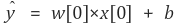
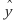
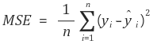
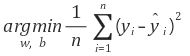
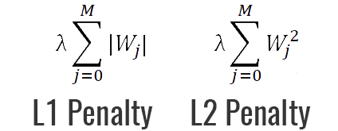
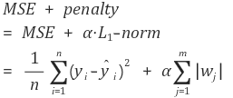
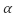

### 선형회귀

---

단순 선형 회귀를 위한 일반화된 예측함수

ex) wave 데이터 셋

x[0]은 **특성(feature)**, 은 **예측 값**, b는 **편향(bias)**, w[0]은 **가중치(weight)** 또는 **계수(coefficient)** 라고 부름

### 목표

데이터셋들의 특성들 (x[0], x[1], x[2], .... , x[p])과 라벨값(y) 사이의 관계를 잘 설명해낼 수 있는 적합한 특성 가중치(w[0], w[1], w[2], ..., w[p])와 b(편향)을 찾는 것

### HOW?

어떻게 적절한 **가중치**와 **편향**을 찾을 까?

선형 회귀는 라벨 값(y)과 예측값() 사이의 **평균제곱오차(mean squared error, MSE)**를 최소화하는 파라미터 w와 b를 찾는다.

(실제 라벨값과 예측값이 작으면 작을수록 예측성능이 좋은 것이기 때문에, MSE를 최소화하는 파라미터 w와 b를 찾는 것이 선형회귀의 목적)

cost 비용을 최소화 하기 위한 최적화 알고리즘 **경사 하강법(Gradient Descent)**를 사용하여 적절한 파라미터를 구한다. (극점을 이용한 최소값 구하기)

### 문제점

과대적합(overfitting) 될 문제가 있음. 주어진 샘플들의 특성값들과 라벨값의 관계를 필요이상으로 너무 복잡하게 분석했기 때문에 나오는 결과. 그러다보니 새로운 데이터가 주어졌을 때 제대로 예측하기 어려움. 즉. 일반화 능력이 떨어짐

### 어떻게 해결할 수 있을까?

우리는 모델의 **복잡도를 제어**할 수 있는 모델을 사용해야 함

=> 라쏘와, 릿지는 추가제약조건을 줌으로 써 모델을 좀 더 단순하게 만들게 해줌

>  MSE가 최소가 되게하는 가중치와 편향을 찾는 동시에, 제약조건도 만족을 해야 함.

**라쏘(Lasso), 릿지(Ridge)**

> MSE가 최소가 되게하는 가중치와 편향을 찾는 동시에, 가중치들의 절대값들의 합, 즉 가중치의 절대값들이 최소(기울기가 작아지도록)가 되게 하는 것. 
>
> 다시 말해서 가중치(w)의 모든 원소가 0이 되거나 0에 가깝게 되어야 한다.

어떤 벡터의 요소들의 절대값들의 합은 L1-norm 이므로 라쏘는 간단히 말해서 **L1-norm 패널티를 가진 선형 회귀 방법**

m은 **가중치의 개수(특성의 개수)**

는 **패널티의 효과를 조절해주는 파라미터**

**MSE와 penalty 항의 합이 최소가 되게 하는 파라미터 w 와 b를 찾는 것이 목적**

=> L1 정규화는 불필요한 피처에 대응하는 가중치들을 0으로 만들어 해당 피처를 모델이 무시하도록 만든다.

